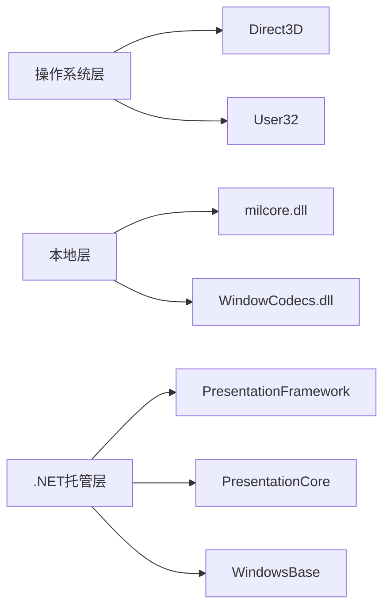
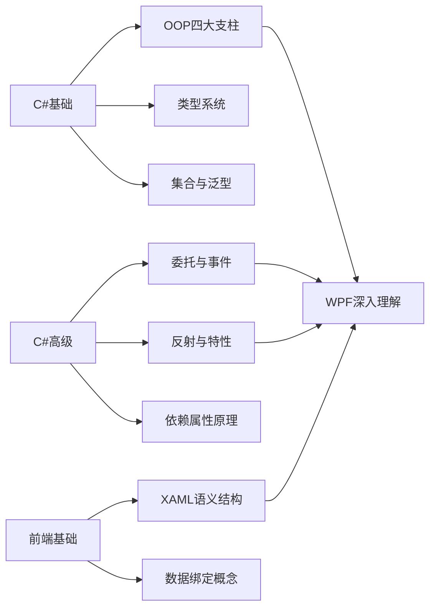
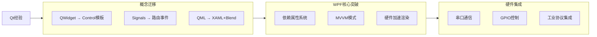

> <font style="color:rgb(51, 51, 51);">零基础入门C#、WPF、数据库，从C#的语法学起，不断深入学习OOP思想（面向对象编程）以及C#高级知识，以实战的方式快速理解封装、继承、多态、抽象、接口、属性、委托、事件、泛型、特性、反射、多线程的概念并掌握其用法，然后，以由浅入深的方式，从整体到细节的渐进学习路径，理论结合实战，学习数据库+WPF框架，包含WPF概述、控件集合、数据绑定、模板样式、资源字典、命令系统、依赖属性、路由事件、动画行为、2D绘图、3D变换等。一条龙专题套餐帮您学透.Net桌面软件开发，成为资深的C#+WPF开发工程师。</font>
>

```plain
┌───────────────────────────────────────────────────────────────────── 学习路径 ─────────────────────────────────────────────────────────────────────┐
│                                                                                                                                                  │
│  ┌───────────────┐    ┌───────────────┐    ┌───────────────┐    ┌───────────────┐    ┌───────────────┐                                         │
│  │  零基础阶段   │───>│ 入门初级阶段    │───>│   中级阶段     │───>│   高级阶段    │───>│  架构师阶段    │                                         │
│  └───────┬───────┘    └───────┬───────┘    └───────┬───────┘    └───────┬───────┘    └───────┬───────┘                                         │
│          │                    │                    │                    │                    │                                                │
│          ▼                    ▼                    ▼                    ▼                    ▼                                                │
│  ┌──────────────────┐  ┌──────────────────────┐  ┌──────────────────────────────┐  ┌──────────────────────────────┐  ┌──────────────────────────┐  │
│  │ C#语法基础       │  │ OOP核心概念          │  │ C#高级特性                   │  │ WPF高级技术                  │  │ 系统架构设计             │  │
│  │ - 变量/数据类型  │  │ - 类与对象           │  │ - 接口/抽象类                │  │ - 依赖属性                   │  │ - MVVM进阶               │  │
│  │ - 流程控制语句    │  │ - 封装/继承/多态     │  │ - 委托/事件                  │  │ - 路由事件                   │  │ - 依赖注入               │  │
│  │ - 数组与字符串    │  │ WPF入门             │  │ - 泛型编程                   │  │ - 动画与行为                 │  │ 性能优化                 │  │
│  │ - 方法定义与调用  │  │ - XAML基础语法       │  │ WPF核心技术                  │  │ - 2D/3D图形                  │  │ - 内存管理               │  │
│  │                  │  │ - 常用控件使用       │  │ - 数据绑定                   │  │ 并发编程                     │  │ - 渲染优化               │  │
│  │                  │  │ 数据库基础           │  │ - 模板与样式                 │  │ - 多线程/异步                │  │ 跨平台方案               │  │
│  │                  │  │ - SQL增删改查        │  │ - 命令系统                   │  │ - Task并行库                 │  │ - .NET MAUI              │  │
│  │                  │  │ - ADO.NET连接        │  │ - 资源字典                   │  │ 反射与特性                   │  │ 项目实战                 │  │
│  │                  │  │                     │  │ EF Core                      │  │ 设计模式                     │  │ - 企业级应用开发         │  │
│  │                  │  │                     │  │ - ORM映射                    │  │                             │  │                          │  │
│  └──────────────────┘  └──────────────────────┘  └──────────────────────────────┘  └──────────────────────────────┘  └──────────────────────────┘  │
│                                                                                                                                                  │
└───────────────────────────────────────────────────────────────────────────────────────────────────────────────────────────────────────────────────┘
```

| **阶段** | **核心内容** | **技术要点** | **实战项目** |
| --- | --- | --- | --- |
| 第一阶段   零基础 | C#语法基础 | - 数据类型/变量/运算符   - 流程控制(if/for/while)   - 数组与集合   - 异常处理 | 控制台计算器   学生成绩管理系统 |
| 第二阶段   入门初级 | OOP+WPF基础+数据库 | - 类/对象/三大特性   - XAML布局原理   - 基础控件使用   - SQLite/ADO.NET | 通讯录管理系统   简易图书管理器 |
| 第三阶段   中级 | C#高级+WPF核心 | - 接口/委托/事件   - 数据绑定/MVVM   - 样式/模板/触发器   - EF Core操作 | 电商商品管理系统   员工考勤系统 |
| 第四阶段   高级 | WPF深度+系统编程 | - 依赖属性系统   - 路由事件机制   - 动画/3D变换   - 多线程/异步 | 实时数据监控仪表盘   多媒体播放器 |
| 第五阶段   架构师 | 架构设计+企业级开发 | - MVVM高级应用   - IoC容器(Prism)   - 性能调优策略   - 安全机制设计 | ERP系统模块   智能工厂控制台 |


### 一、WPF前端代码范例（XAML）
```xml
<!-- 基础窗口结构 -->
<Window xmlns="http://schemas.microsoft.com/winfx/2006/xaml/presentation"
        Title="窗体标题" 
        Width="250" Height="100">
    <!-- 声明式UI元素 -->
    <Button Name="button">按钮文字</Button>
</Window>

```

**核心特征**：

1. 声明式编程：通过XML语法描述UI结构
2. 元素树组织：采用父容器-子元素的层级结构
3. 命名空间机制：`xmlns`引用WPF核心程序集

---

### 二、WPF本质解析
| 维度 | 说明 |
| --- | --- |
| **技术定位** | 基于.NET的Windows桌面UI框架 |
| **核心构成** | 托管类库+操作系统级组件的融合架构 |
| **设计目标** | 统一2D/3D/文档/媒体开发模型 |


---

### 三、WPF分层架构体系

#### 1. 操作系统级组件
+ **Direct3D**：硬件加速的3D渲染引擎
+ **User32**：窗口管理基础服务

#### 2. 本地非托管层
+ **milcore.dll**：
    - 实现媒体集成层（MIL）
    - 封装DirectX接口
    - 负责2D/3D渲染管道
+ **WindowCodecs.dll**：
    - 图像处理引擎
    - 支持位图操作/格式转换

#### 3. .NET托管层
| 程序集 | 核心类型 | 功能定位 |
| --- | --- | --- |
| **WindowsBase** | `DispatcherObject`   `DependencyObject` | 线程调度/依赖属性系统 |
| **PresentationCore** | `Visual`   `UIElement` | 视觉树管理   路由事件系统 |
| **PresentationFramework** | `FrameworkElement`   `Window`   `Control` | 控件库   布局系统   数据绑定引擎 |


**类型继承链**：

```plain
DispatcherObject → DependencyObject → Visual → UIElement → FrameworkElement → Control
```

---

### 四、WPF核心能力矩阵
| 能力维度 | 关键技术 | 应用价值 |
| --- | --- | --- |
| **界面构建** | XAML+控件库 | 声明式UI开发   快速界面原型 |
| **视觉呈现** | 矢量图形   分辨率无关渲染 | 高清显示支持   动态缩放不失真 |
| **交互系统** | 路由事件   命令绑定 | 复杂事件处理   解耦业务逻辑 |
| **数据驱动** | 数据绑定   MVVM模式 | 前后端分离   可测试性提升 |
| **样式系统** | 模板/样式/触发器 | 定制化外观   视觉状态管理 |
| **性能优化** | GPU硬件加速   异步渲染 | 流畅动画体验   低CPU占用 |


---

### 五、WPF革命性创新
1. **矢量图形引擎**

```xml
<Path Data="M 10,100 C 100,0 200,200 300,100" 
      Stroke="Blue" StrokeThickness="3"/>
```

    - 基于数学方程而非像素点
    - 示例：`<Path>`元素实现无损缩放
2. **精确坐标系统**
    - 双精度浮点坐标（double类型）
    - 亚像素级定位精度
3. **数据驱动范式**

```csharp
// ViewModel
public class UserViewModel : INotifyPropertyChanged
{
    private string _name;
    public string Name
    {
        get => _name;
        set { _name = value; OnPropertyChanged(); }
    }
}
```

```xml
<!-- View绑定 -->
<TextBlock Text="{Binding Name}"/>
```

4. **硬件加速渲染**
    - 通过DirectX访问GPU
    - 复杂动画60fps流畅渲染

---

### 六、WPF适用场景
1. **企业级桌面应用**
    - ERP/CRM系统
    - 数据可视化看板
2. **富媒体应用**
    - 交互式电子手册
    - 工业控制界面
3. **高精度显示需求**
    - 医疗影像系统
    - CAD辅助设计

> **技术定位**：WPF是构建现代Windows桌面应用的终极解决方案，尤其适合需要复杂UI、数据可视化、高性能渲染的场景。其架构设计平衡了开发效率与执行性能，通过MVVM模式实现了前后端彻底解耦，为大型应用开发提供了可持续维护的工程基础。
>

以下是对WPF学习路径的系统化总结，特别针对C#基础与WPF核心技术的衔接要点：

### 七、WPF学习前提：C#核心技术栈


### 八、必须掌握的C#关键技术
#### 1. OOP核心思想
```csharp
// 多态性在WPF中的应用示例
public abstract class Shape
{
    public abstract void Draw();
}

public class Circle : Shape
{
    public override void Draw() 
    { /* WPF绘制圆形逻辑 */ }
}

// 在XAML中通过DataTemplate实现多态
<DataTemplate DataType="{x:Type local:Circle}">
    <Ellipse Fill="Red" Width="50" Height="50"/>
</DataTemplate>

```

#### 2. 特性(Attribute)系统
```csharp
// WPF依赖属性注册中的特性应用
[DependencyProperty.Register(
    "Width", 
    typeof(int), 
    typeof(OwnerClass), 
    new FrameworkPropertyMetadata(0)
)]
public int Width { /* 属性包装器 */ }
```

#### 3. 委托与事件
```csharp
// WPF路由事件系统的底层实现
public delegate void RoutedEventHandler(object sender, RoutedEventArgs e);

// 自定义路由事件注册
public static readonly RoutedEvent TapEvent = 
    EventManager.RegisterRoutedEvent(
        "Tap", 
        RoutingStrategy.Bubble, 
        typeof(RoutedEventHandler), 
        typeof(CustomControl));
```

#### 4. 反射机制
```csharp
// WPF依赖属性注册的反射原理
PropertyInfo prop = typeof(OwnerClass).GetProperty("Width");
Type ownerType = prop.DeclaringType;
DependencyProperty.Register(
    prop.Name, 
    prop.PropertyType, 
    ownerType,  // 通过反射获取类型
    new PropertyMetadata(0));
```

### 九、WPF特有概念解析
#### 1. 依赖属性 vs CLR属性
| 特性 | 依赖属性 | CLR属性 |
| --- | --- | --- |
| **存储机制** | 全局属性存储 | 对象实例存储 |
| **默认值** | 可设置默认值 | 需显式初始化 |
| **变更通知** | 内置通知机制 | 需手动实现INPC |
| **值继承** | 支持元素树继承 | 不支持 |
| **动画支持** | 原生支持 | 需额外实现 |


#### 2. 路由事件工作模型

```csharp
sequenceDiagram
    participant Child as 子控件
    participant Parent as 父容器
    participant Root as 根元素
    
    Child->>Parent: 冒泡阶段(Bubbling)
    Parent->>Root: 继续冒泡
    Root-->>Parent: 隧道阶段(Tunneling)
    Parent-->>Child: 继续隧道
    Note over Child: 直接事件处理(Direct)
``` 

### 十. 学习技巧
1. **调试技巧**：

```csharp
// 查看绑定错误
PresentationTraceSources.DataBindingSource.Switch.Level = SourceLevels.All;

// 输出窗口显示绑定详情
System.Diagnostics.PresentationTraceSources.DataBindingSource.Listeners.Add(
    new ConsoleTraceListener());
```

2. **理解视觉树**：

```csharp
// 遍历视觉树
public static IEnumerable<T> FindVisualChildren<T>(DependencyObject depObj) 
    where T : DependencyObject
{
    for (int i = 0; i < VisualTreeHelper.GetChildrenCount(depObj); i++)
    {
        var child = VisualTreeHelper.GetChild(depObj, i);
        if (child is T typedChild) yield return typedChild;
        foreach (var childOfChild in FindVisualChildren<T>(child)) 
            yield return childOfChild;
    }
}
```

3. **MVVM模式实践**：

```csharp
// 基础ViewModel实现
public class ViewModelBase : INotifyPropertyChanged
{
    public event PropertyChangedEventHandler PropertyChanged;
    
    protected virtual void OnPropertyChanged([CallerMemberName] string name = null)
    {
        PropertyChanged?.Invoke(this, new PropertyChangedEventArgs(name));
    }
}
```

#### 4、学习路线图
#### 第一阶段：基础入门（2-3周）  
  ├─ XAML语法精要  
  ├─ 常用布局控件（Grid, StackPanel）  
  ├─ 数据绑定基础（Binding Path）  
  └─ 样式与资源基础  
  
第二阶段：核心技术（4-6周）  
  ├─ 高级数据绑定（Converter, MultiBinding）  
  ├─ 命令系统（ICommand, RelayCommand）  
  ├─ 模板系统（ControlTemplate, DataTemplate）  
  └─ 用户控件开发  
  
第三阶段：高级精通（8-12周）  
  ├─ 依赖属性系统（自定义DP）  
  ├─ 路由事件机制（冒泡/隧道）  
  ├─ 动画与行为（Behaviors）  
  ├─ 3D图形与多媒体  
  └─ MVVM框架整合（Prism等）
> #### **学习箴言**：WPF学习需遵循"先会用，再懂理"的实践路径。建议采用：
> #### **小步快跑**：每学一个概念立即创建微型Demo验证
> #### **逆向工程**：反编译优秀开源项目（如MaterialDesignInXAML）
> #### **知识迁移**：将WinForm经验与WPF新特性对比学习
> #### **工具赋能**：善用LiveXAML、Snoop等开发辅助工具

#### 以下是为嵌入式开发工程师量身定制的WPF学习路径，结合您的Qt开发经验进行针对性优化：
### 十一、Qt与WPF核心概念映射表
| Qt概念 | WPF对应概念 | 差异点 | 学习建议 |
| --- | --- | --- | --- |
| QWidget | UIElement | WPF更强调组合而非继承 | 重点学习控件模板 |
| Signals/Slots | 路由事件/绑定/命令 | WPF提供多种交互机制 | 掌握事件路由策略 |
| QML | XAML | 语法相似但数据绑定更强 | 对比学习声明式语法 |
| Model/View | MVVM | MVVM是更严格的分离模式 | 深入理解INotifyPropertyChanged |
| Q_PROPERTY | 依赖属性 | 依赖属性有值继承机制 | 研究属性变更回调 |
| QLayout | Panel派生类 | WPF布局系统更灵活 | 掌握Grid和DockPanel |
| QGraphicsView | Visual层 | WPF有更完善的视觉树 | 学习视觉树遍历方法 |


### 十二、重点领域深度适配
#### 1. 硬件交互层实现
```csharp
// 串口通信封装（对比Qt的QSerialPort）
public class SerialService : IDisposable
{
    private SerialPort _port;
    
    public SerialService(string portName)
    {
        _port = new SerialPort(portName, 9600, Parity.None, 8, StopBits.One);
        _port.DataReceived += OnDataReceived;
    }
    
    private void OnDataReceived(object sender, SerialDataReceivedEventArgs e)
    {
        byte[] data = new byte[_port.BytesToRead];
        _port.Read(data, 0, data.Length);
        
        // 通过事件或绑定更新UI
        DataReceived?.Invoke(this, data);
    }
    
    public event EventHandler<byte[]> DataReceived;
}
```

#### 2. 实时数据可视化
```xml
<!-- 工业仪表盘实现（对比Qt的QChart） -->
<Canvas>
    <Path Data="M 100,100 A 50,50 0 1 1 200,100"
          Stroke="Blue" StrokeThickness="3"/>
    
    <!-- 实时指针 -->
    <Line X1="150" Y1="150" X2="{Binding Angle, Converter={StaticResource AngleConverter}}"
          Stroke="Red" StrokeThickness="2"/>
    
    <!-- 数据绑定 -->
    <TextBlock Text="{Binding Temperature, StringFormat='{}{0}°C'}"
               Canvas.Top="200" Canvas.Left="130"/>
</Canvas>

```

### 十三、嵌入式场景优化学习模块
#### 1. 低延迟渲染技术
```csharp
// 利用CompositionTarget.Rendering实现60fps渲染
CompositionTarget.Rendering += (s, e) =>
{
    if (_sensorDataAvailable)
    {
        waveForm.InvalidateVisual(); // 自定义波形控件重绘
    }
};

// 对比Qt的QTimer+update()
```

#### 2. 硬件资源管理
| 资源类型 | Qt方案 | WPF方案 | 注意事项 |
| --- | --- | --- | --- |
| 串口 | QSerialPort | System.IO.Ports | 需处理UI线程调度 |
| USB | libusb | HidLibrary | 驱动兼容性测试 |
| 网络协议 | QTcpSocket | System.Net.Sockets | 异步操作避免UI阻塞 |
| 传感器数据 | QSensor | 自定义ISensor接口 | 数据滤波处理 |


### 十三、避坑指南（相对Qt学习者）
1. **线程管理差异**：

```csharp
// 错误方式（直接跨线程更新UI）
void OnDataReceived(byte[] data)
{
    txtValue.Text = data.ToString(); // 引发异常
}

// 正确方式
void OnDataReceived(byte[] data)
{
    Dispatcher.Invoke(() => txtValue.Text = data.ToString());
}
```

2. **内存管理对比**：

| 特性 | Qt | WPF |
| --- | --- | --- |
| 对象生命周期 | 父子对象树 | GC垃圾回收 |
| 资源释放 | deleteLater() | IDisposable模式 |
| 事件处理 | 需手动disconnect | 弱事件模式支持 |


3. **渲染性能优化**：

```xml
<!-- 启用硬件加速 -->
<Window ...
        AllowsTransparency="False"
        TextOptions.TextFormattingMode="Display"
        RenderOptions.BitmapScalingMode="NearestNeighbor">
```

### 十四、实战项目演进路线
```plain
阶段1：设备监控面板（2周）
  ├─ 串口数据采集
  ├─ 实时曲线绘制（Canvas）
  ├─ 基础MVVM实现

阶段2：工业控制台（3周）
  ├─ Modbus/TCP协议集成
  ├─ 3D设备模型展示（HelixToolkit）
  ├─ 动画状态指示器

阶段3：智能网关系统（4周）
  ├─ 多线程数据采集
  ├─ WCF远程控制接口
  ├─ 数据持久化（SQLite）
  ├─ 响应式布局设计
```

### 十五、硬件开发专属工具链
1. **调试工具**：
    - Snoop：实时检查WPF视觉树
    - WPF Performance Suite：渲染性能分析
2. **硬件集成库**：
    - LibUsbDotNet：USB设备访问
    - NModbus：工业协议实现
    - OPC-UA库：工业自动化标准
3. **3D渲染框架**：

```xml
<helix:HelixViewport3D>
    <helix:SunLight/>
    <helix:MeshGeometryVisual3D MeshGeometry="{Binding SensorModel}"/>
</helix:HelixViewport3D>

```


> 
>


