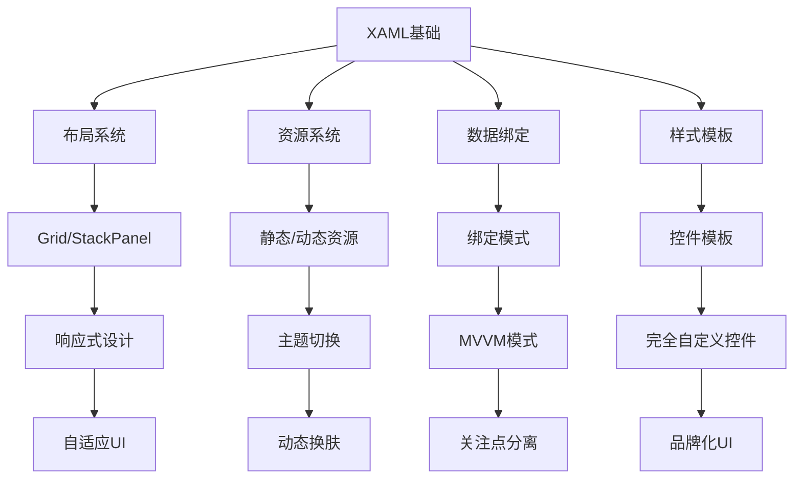

XAML（eXtensible Application Markup Language）是WPF的核心技术，它是一种基于XML的声明式语言，用于定义用户界面和应用程序结构。下面我将全面讲解XAML的各种格式和设置。

## 一、XAML基础结构
### 1. 基本文档结构
```xml
<Window x:Class="MyApp.MainWindow"
        xmlns="http://schemas.microsoft.com/winfx/2006/xaml/presentation"
        xmlns:x="http://schemas.microsoft.com/winfx/2006/xaml"
        Title="Main Window" Height="450" Width="800">
    <!-- 只能有一个根子元素 -->
    <Grid>
        <!-- UI元素放在这里 -->
    </Grid>
</Window>

```

### 2. 核心组成部分
+ **根元素**：Window、Page、UserControl等
+ **命名空间声明**：
    - `xmlns`：WPF核心命名空间
    - `xmlns:x`：XAML语言特性命名空间
+ **x:Class属性**：关联后台代码文件
+ **属性设置**：直接在元素上设置属性值

## 二、属性设置方式详解
### 1. 直接属性设置
```xml
<Button Content="Click Me" 
        Background="#FF4C5FF5" 
        Foreground="White"
        Margin="10" 
        Padding="15,5"
        FontSize="14"/>
```

### 2. 属性元素语法
当属性值复杂时使用：

```xml
<Button>
    <Button.Background>
        <LinearGradientBrush>
            <GradientStop Color="#FF4C5FF5" Offset="0"/>
            <GradientStop Color="#3A5BFF" Offset="1"/>
        </LinearGradientBrush>
    </Button.Background>
    <Button.Content>
        <StackPanel Orientation="Horizontal">
            <Image Source="icon.png" Width="16" Height="16"/>
            <TextBlock Text="Click Me" Margin="5,0,0,0"/>
        </StackPanel>
    </Button.Content>
</Button>

```

### 3. 内容属性简写
当属性被标记为内容属性时：

```xml
<!-- 标准写法 -->
<Button>
    <Button.Content>
        Click Me
    </Button.Content>
</Button>
<!-- 简写写法 -->
<Button>Click Me</Button>

```

### 4. 标记扩展
XAML提供多种标记扩展：

```xml
<!-- 数据绑定 -->
<TextBlock Text="{Binding UserName, Mode=OneWay}"/>

<!-- 静态资源 -->
<Button Background="{StaticResource PrimaryBrush}"/>

<!-- 动态资源 -->
<Border BorderBrush="{DynamicResource BorderColor}"/>

<!-- 相对绑定 -->
<TextBlock Text="{Binding RelativeSource={RelativeSource AncestorType=Window}, Path=Title}"/>

<!-- 模板绑定 -->
<ControlTemplate TargetType="Button">
    <Border Background="{TemplateBinding Background}"/>
</ControlTemplate>

```

## 三、布局系统详解
### 1. 常用布局容器
```xml
<!-- Grid布局 -->
<Grid>
    <Grid.RowDefinitions>
        <RowDefinition Height="Auto"/>
        <RowDefinition Height="*"/>
        <RowDefinition Height="2*"/>
    </Grid.RowDefinitions>
    <Grid.ColumnDefinitions>
        <ColumnDefinition Width="Auto"/>
        <ColumnDefinition Width="*"/>
    </Grid.ColumnDefinitions>
    
    <TextBlock Grid.Row="0" Grid.Column="0" Text="Name:"/>
    <TextBox Grid.Row="0" Grid.Column="1" Text="{Binding Name}"/>
    
    <ListBox Grid.Row="1" Grid.ColumnSpan="2" ItemsSource="{Binding Items}"/>
</Grid>
<!-- StackPanel布局 -->
<StackPanel Orientation="Vertical">
    <Label Content="Username"/>
    <TextBox/>
    <Label Content="Password"/>
    <PasswordBox/>
    <Button Content="Login" Margin="0,10"/>
</StackPanel>
<!-- DockPanel布局 -->
<DockPanel LastChildFill="True">
    <Menu DockPanel.Dock="Top">...</Menu>
    <StatusBar DockPanel.Dock="Bottom">...</StatusBar>
    <ToolBar DockPanel.Dock="Left">...</ToolBar>
    <ContentControl>主内容区</ContentControl>
</DockPanel>

```

### 2. 布局属性
| 属性 | 描述 | 示例 |
| --- | --- | --- |
| `Margin` | 外边距 | `Margin="10"`、`Margin="5,10,5,10"` |
| `Padding` | 内边距 | `Padding="5"` |
| `HorizontalAlignment` | 水平对齐 | `Left`、`Center`、`Right`、`Stretch` |
| `VerticalAlignment` | 垂直对齐 | `Top`、`Center`、`Bottom`、`Stretch` |
| `Width/Height` | 显式尺寸 | `Width="100"`、`Height="Auto"` |


## 四、资源系统
### 1. 资源定义与引用
```xml
<Window.Resources>
    <!-- 简单资源 -->
    <SolidColorBrush x:Key="PrimaryBrush" Color="#FF4C5FF5"/>
    
    <!-- 样式资源 -->
    <Style x:Key="RoundButtonStyle" TargetType="Button">
        <Setter Property="Background" Value="{StaticResource PrimaryBrush}"/>
        <Setter Property="Foreground" Value="White"/>
        <Setter Property="Padding" Value="12,6"/>
        <Setter Property="Template">
            <Setter.Value>
                <ControlTemplate TargetType="Button">
                    <Border CornerRadius="8" Background="{TemplateBinding Background}">
                        <ContentPresenter HorizontalAlignment="Center" VerticalAlignment="Center"/>
                    </Border>
                </ControlTemplate>
            </Setter.Value>
        </Setter>
    </Style>
    
    <!-- 数据模板 -->
    <DataTemplate x:Key="PersonTemplate" DataType="local:Person">
        <StackPanel Orientation="Horizontal">
            <TextBlock Text="{Binding Name}" FontWeight="Bold"/>
            <TextBlock Text=" - "/>
            <TextBlock Text="{Binding Age}"/>
        </StackPanel>
    </DataTemplate>
</Window.Resources>
<!-- 资源引用 -->
<Button Style="{StaticResource RoundButtonStyle}" Content="Submit"/>
```

### 2. 资源作用域
| 级别 | 定义位置 | 访问范围 |
| --- | --- | --- |
| 元素级 | 元素.Resources | 当前元素及子元素 |
| 窗口级 | Window.Resources | 当前窗口 |
| 应用级 | App.xaml | 全局可用 |
| 主题级 | Themes/generic.xaml | 整个应用程序 |


## 五、数据绑定
### 1. 绑定基础
```xml
<!-- 简单绑定 -->
<TextBlock Text="{Binding UserName}"/>

<!-- 带路径的绑定 -->
<TextBlock Text="{Binding User.Address.City}"/>

<!-- 带转换器的绑定 -->
<TextBlock Text="{Binding BirthDate, StringFormat='yyyy-MM-dd'}"/>
<TextBlock Text="{Binding Temperature, Converter={StaticResource TemperatureConverter}}"/>

<!-- 多绑定 -->
<TextBlock>
    <TextBlock.Text>
        <MultiBinding StringFormat="{}{0} {1}">
            <Binding Path="FirstName"/>
            <Binding Path="LastName"/>
        </MultiBinding>
    </TextBlock.Text>
</TextBlock>

```

### 2. 绑定模式
| 模式 | 描述 | 语法 |
| --- | --- | --- |
| OneWay | 源→目标 | `{Binding Path, Mode=OneWay}` |
| TwoWay | 双向绑定 | `{Binding Path, Mode=TwoWay}` |
| OneTime | 仅初始化 | `{Binding Path, Mode=OneTime}` |
| OneWayToSource | 目标→源 | `{Binding Path, Mode=OneWayToSource}` |


## 六、样式与模板
### 1. 样式系统
```xml
<!-- 隐式样式（自动应用到所有匹配类型） -->
<Style TargetType="TextBlock">
    <Setter Property="FontSize" Value="14"/>
    <Setter Property="Margin" Value="0,5"/>
</Style>
<!-- 显式样式 -->
<Style x:Key="HeaderText" TargetType="TextBlock" BasedOn="{StaticResource {x:Type TextBlock}}">
    <Setter Property="FontSize" Value="18"/>
    <Setter Property="FontWeight" Value="Bold"/>
    <Setter Property="Foreground" Value="DarkBlue"/>
</Style>

```

### 2. 控件模板
```xml
<ControlTemplate x:Key="CustomButtonTemplate" TargetType="Button">
    <Border x:Name="border" 
            CornerRadius="8"
            Background="{TemplateBinding Background}"
            BorderBrush="{TemplateBinding BorderBrush}"
            BorderThickness="1">
        <ContentPresenter HorizontalAlignment="Center" VerticalAlignment="Center"/>
    </Border>
    <ControlTemplate.Triggers>
        <Trigger Property="IsMouseOver" Value="True">
            <Setter TargetName="border" Property="Background" Value="#3A5BFF"/>
            <Setter TargetName="border" Property="BorderBrush" Value="#B0C4FF"/>
        </Trigger>
    </ControlTemplate.Triggers>
</ControlTemplate>

```

## 七、动画与视觉效果
### 1. 基本动画
```xml
<Button Content="Animate">
    <Button.Triggers>
        <EventTrigger RoutedEvent="Button.Click">
            <BeginStoryboard>
                <Storyboard>
                    <DoubleAnimation
                        Storyboard.TargetProperty="Width"
                        From="100" To="200" Duration="0:0:0.5"
                        AutoReverse="True"/>
                    <ColorAnimation
                        Storyboard.TargetProperty="Background.Color"
                        To="LightGreen" Duration="0:0:0.5"
                        AutoReverse="True"/>
                </Storyboard>
            </BeginStoryboard>
        </EventTrigger>
    </Button.Triggers>
</Button>

```

### 2. 变换效果
```xml
<Button Content="Transform">
    <Button.RenderTransform>
        <TransformGroup>
            <RotateTransform Angle="0" x:Name="rotate"/>
            <ScaleTransform ScaleX="1" ScaleY="1" x:Name="scale"/>
        </TransformGroup>
    </Button.RenderTransform>
    <Button.Triggers>
        <EventTrigger RoutedEvent="Button.MouseEnter">
            <BeginStoryboard>
                <Storyboard>
                    <DoubleAnimation 
                        Storyboard.TargetName="rotate"
                        Storyboard.TargetProperty="Angle"
                        To="10" Duration="0:0:0.2"/>
                    <DoubleAnimation 
                        Storyboard.TargetName="scale"
                        Storyboard.TargetProperty="ScaleX"
                        To="1.05" Duration="0:0:0.2"/>
                </Storyboard>
            </BeginStoryboard>
        </EventTrigger>
    </Button.Triggers>
</Button>

```

## 八、高级技巧与最佳实践
### 1. XAML命名规范
```xml
<!-- 使用有意义的名称 -->
<Button x:Name="SubmitButton" Content="Submit"/>
<TextBox x:Name="UsernameTextBox"/>
<ListView x:Name="CustomerListView"/>
```

### 2. 资源组织策略
```xml
<!-- 资源字典 -->
<ResourceDictionary>
    <ResourceDictionary.MergedDictionaries>
        <ResourceDictionary Source="Styles/Brushes.xaml"/>
        <ResourceDictionary Source="Styles/Buttons.xaml"/>
        <ResourceDictionary Source="Styles/TextStyles.xaml"/>
    </ResourceDictionary.MergedDictionaries>
    
    <!-- 本地资源 -->
</ResourceDictionary>

```

### 3. 设计时数据
```xml
xmlns:d="http://schemas.microsoft.com/expression/blend/2008"
d:DataContext="{d:DesignInstance Type=local:DesignViewModel}"

<!-- 使用示例 -->
<ListBox ItemsSource="{Binding Customers}" 
         d:ItemsSource="{d:DesignData Source=SampleData/Customers.xaml}"/>
```

### 4. 性能优化技巧
```xml
<!-- 虚拟化长列表 -->
<ListView VirtualizingStackPanel.IsVirtualizing="True"
          VirtualizingStackPanel.VirtualizationMode="Recycling">
    <!-- ... -->
</ListView>
<!-- 冻结静态资源 -->
<SolidColorBrush x:Key="StaticBrush" Color="Blue" PresentationOptions:Freeze="True"/>

<!-- 延迟滚动 -->
<ScrollViewer IsDeferredScrollingEnabled="True">
    <ItemsControl ... />
</ScrollViewer>

```

## 九、调试与问题排查
### 1. 绑定调试
```xml
<!-- 启用绑定跟踪 -->
<TextBlock Text="{Binding UserName, 
    diag:PresentationTraceSources.TraceLevel=High}"/>
```

### 2. 可视化树检查
```csharp
// 在代码中遍历可视化树
public static T FindVisualChild<T>(DependencyObject obj) where T : DependencyObject
{
    for (int i = 0; i < VisualTreeHelper.GetChildrenCount(obj); i++)
    {
        var child = VisualTreeHelper.GetChild(obj, i);
        if (child is T result) 
            return result;
        
        var childResult = FindVisualChild<T>(child);
        if (childResult != null) 
            return childResult;
    }
    return null;
}
```

### 3. 常见错误解决
1. **"属性'Child'只能设置一次"**：
    - 确保容器元素只有一个直接子元素
    - 使用布局容器（如Grid、StackPanel）包裹多个元素
2. **"InitializeComponent未找到"**：
    - 检查x:Class命名空间与代码文件一致
    - 清理并重新生成项目
    - 确保XAML文件生成操作为"Page"

## 总结
XAML是WPF的核心，掌握其各种格式和设置技巧对于构建现代桌面应用至关重要。关键要点包括：

1. **声明式UI**：使用XAML清晰分离界面与逻辑
2. **强大布局**：灵活运用Grid、StackPanel等布局容器
3. **资源复用**：通过资源字典实现样式和模板共享
4. **数据驱动**：利用数据绑定实现MVVM模式
5. **视觉定制**：通过控件模板完全自定义控件外观
6. **动画效果**：使用Storyboard创建流畅用户体验




