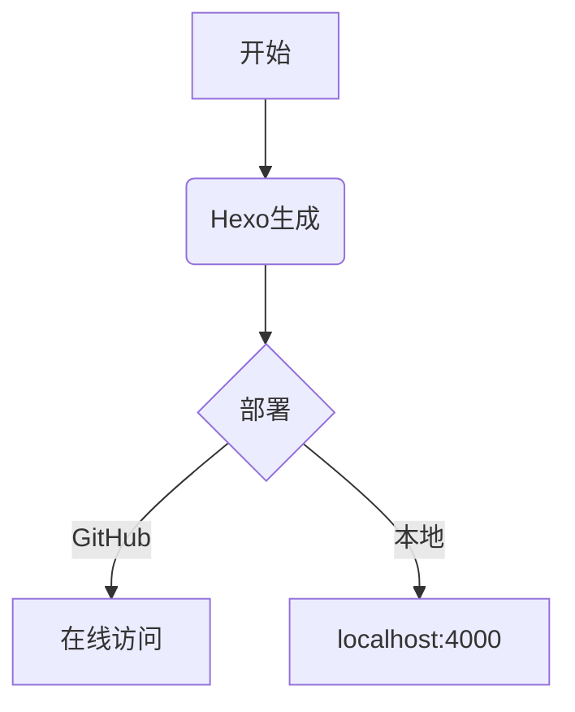

title: Hello World
date: 2013-12-24 17:49:32
tags:
cover: https://pic4.zhimg.com/v2-b96eb3d286b92f5e388a7e1e94fb19f3_1440w.jpg
sponsor: false # 是否展示赞助二维码？
---

Welcome to [Hexo](http://zespia.tw/hexo)! This is your very first post. Check [documentation](http://zespia.tw/hexo/docs) to learn how to use.


::: info
This is an info box.
:::

::: tip
This is a tip.
:::

::: warning
This is a warning.
:::

::: danger
This is a dangerous warning.
:::

::: danger STOP
Danger zone, do not proceed
:::

::: details
This is a details block.
:::

---



珊瑚宫心海作为海祇岛的"现人神巫女"，不仅是反抗军的领袖，更是一位精通兵法与治愈之术的智者

珊瑚宫心海曾言："战争不是目的，而是手段。真正的胜利不在于击败敌人，而在于守护人民的笑容。"这份理念让她在领导反抗军时始终保持清醒的头脑。在《原神》的故事中，珊瑚宫心海展现了非凡的领导才能。

她以"深海舌鲆鱼"为代号制定的作战计划精妙绝伦，连天领奉行的将领都为之惊叹。

这种将军事才能与人文关怀结合的特质，使她成为稻妻最受尊敬的人物之一。
**心海的元素爆发"海人化羽"** 不仅能治愈全队，还能召唤 *化海月* 持续恢复生命，体现了她<mark>既是军师也是医者</mark>的双重身份。珊瑚宫心海的神之眼是水系，这象征着她如水般柔韧而不可摧的特质——既能以智慧化解冲突，又能以坚韧抵御压迫心海的命之座"眠龙座"暗示着她体内沉睡的龙族血脉，这也是她能同时掌控治愈与破坏两种力量的原因

"兵无常势，水无常形"——这是珊瑚宫心海最常引用的兵法精髓，也是她应对眼狩令危机的核心策略
> 在稻妻内战期间，珊瑚宫心海面临巨大压力：
既要抵御幕府军的进攻，又要防止愚人众的渗透，同时还要维持海祇岛民众的生计
> 这种复杂局面下，她展现了超越年龄的政治智慧和战略眼光

"真正的领袖不在于力量强弱，而在于能否在黑暗中为子民点亮希望的灯火"



分析元素战技「海月之誓」：
> 召唤化海月持续治疗领域内角色  
治疗量基于心海的生命值上限，每2秒恢复一次，持续12秒——这稳定的治疗节奏正如 Pull Quote 在长文中提供的视觉呼吸点探讨「现人神巫女」的宗教含义：海祇大御神奥罗巴斯陨落后，心海作为人神沟通的桥梁，其服饰上的「逆鳞」纹样象征牺牲精神，这与 Pull Quote 自我聚焦以服务全文的定位异曲同工



珊瑚宫心海的战术风格：
```python
def kokomi_strategy(situation):
    if situation.threat_level > 7:
        return "退守+治疗"
    elif resources_adequate(situation):
        return "水母部署+游击战"
    else:
        return "祈雨+谈判"
```



# H1 珊瑚宫心海
## H2 珊瑚宫心海
### H3 珊瑚宫心海
#### H4 珊瑚宫心海
##### H5 珊瑚宫心海
###### H6 珊瑚宫心海

**加粗文本** 和 *斜体文本*  
~~删除线~~ 和 ++下划线++  
`行内代码` 和 [链接](https://hexo.io)

---

## 列表类型
### 无序列表
- Item 1
- Item 2
  - 子项目 2.1
  - 子项目 2.2

### 有序列表
1. 第一项
2. 第二项
   1. 嵌套项 2.1
   2. 嵌套项 2.2

### 定义列表
HTML
: 超文本标记语言

CSS
: 层叠样式表

---

## 表格示例
| 左对齐 | 居中对齐 | 右对齐 |
| :----- | :------: | -----: |
| 单元格 |  单元格  |  单元格 |
| 内容   |  内容    |    $99 |

---

## 其他元素
- 缩写：<abbr title="HyperText Markup Language">HTML</abbr>
- 下标：H<sub>2</sub>O
- 上标：E = mc<sup>2</sup>
- 键盘输入：<kbd>Ctrl</kbd>+<kbd>C</kbd>

---

## 图片


### 分隔线
***
水平分隔线示例

---

## 代码块
```js
// JavaScript 代码示例
const hexo = require('hexo');
console.log(`Hexo version: ${hexo.version}`);
```

```python
# Python 代码示例
def hello_hexo():
    print("Hello Hexo!")
```

---

## 引用块
> 这是一个引用块  
> 第二行引用内容  
> — *引用来源*

---

## 数学公式 
$$
f(x) = \int_{-\infty}^\infty \hat f(\xi)\,e^{2 \pi i \xi x} \,d\xi
$$

行内公式：$E = mc^2$

---

## 流程图 



---

## 标签插件







