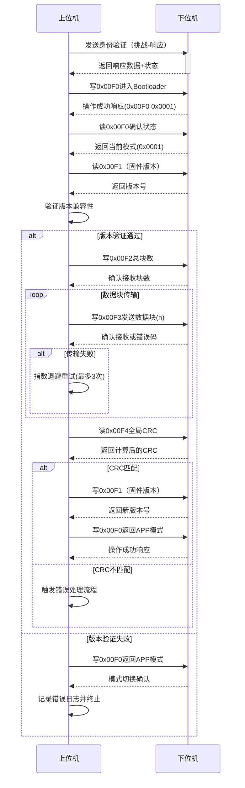
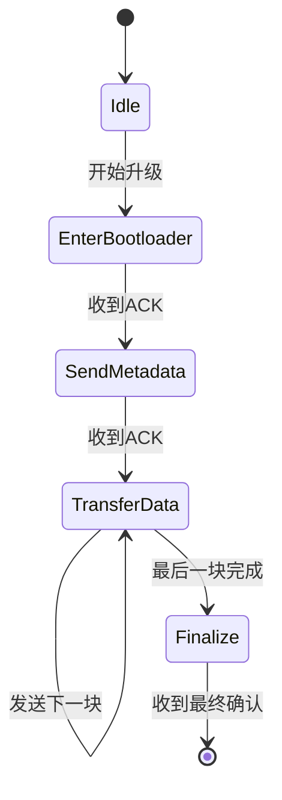

---

## 一、串口协议配置
### 1. 基本串口参数
```cpp
// Qt串口配置代码
QSerialPort serial;
serial.setPortName("COM1");       // 用户可选择端口
serial.setBaudRate(QSerialPort::Baud9600);
serial.setDataBits(QSerialPort::Data8);
serial.setParity(QSerialPort::NoParity);
serial.setStopBits(QSerialPort::OneStop);
serial.setFlowControl(QSerialPort::NoFlowControl);

// 连接接收槽函数
connect(&serial, &QSerialPort::readyRead, this, &ModbusMaster::handleReadyRead);
```

## 二、Hex文件处理
### 1. 文件解析与转换
```cpp
bool ModbusMaster::loadAndParseHexFile(const QString &filePath) 
{
    QFile file(filePath);
    if (!file.open(QIODevice::ReadOnly)) {
        qWarning() << "文件打开失败:" << filePath;
        return false;
    }

    // 此处简化处理直接读取二进制数据
    QByteArray data = file.readAll();
    file.close();

    // 分块处理（512字节/块）
    for (int i = 0; i < data.size(); i += 512) {
        QByteArray block = data.mid(i, 512);
        if(block.size() < 512) {
            block.append(QByteArray(512 - block.size(), 0xFF)); // 填充0xFF
        }
        dataBlocks.append(block);
    }
    
    return !dataBlocks.isEmpty();
}
```

## 三、Modbus-RTU协议帧格式
### 1. 数据帧结构
| 字段 | 长度 | 说明 |
| --- | --- | --- |
| 从机地址 | 1字节 | 目标设备地址（0x01~0xFF） |
| 功能码 | 1字节 | 0x03读/0x10写多寄存器 |
| 数据地址 | 2字节 | 寄存器起始地址 |
| 数据内容 | N字节 | 最好的方式是block号(2字节)+512字节数据 |
| CRC校验 | 2字节 | Modbus CRC16校验 |


### 2. 关键寄存器定义
| 寄存器地址 | 类型 | 功能描述 |
| --- | --- | --- |
| 0x00E0 | 读写 | 状态寄存器（0:APP, 1:Bootloader）用于确认当前状态（读取回复00 xx，写入需要加校验（cc xx），可使用读UID校验进入bootloder） |
| 0x00E1 | 读写 | 固件版本号（例如0x0102表示V1.2）上位机读取文件名 |
| 0x00E2 | 只写 | 总数据块数（数据长度/512 + 1） |
| 0x00E3 | 写 | 数据块写入接口 |
| 0x00E4 | 读 | 完整CRC校验 |


## 四、核心功能实现
### 1. 数据发送模块
```cpp
QByteArray ModbusMaster::createModbusRequest(const bankNum,const QByteArray &data) {
    /* 自定义Bootloader协议帧格式：
       ---------------------------------------------------
       | 地址(1) | 功能码(1) | 块序号(2) | 数据块(512) | CRC16(2)    |
       --------------------------------------------------- */
    QByteArray frame;
    quint8 slaveAddr = 0x01;       // 从机地址
    quint8 funcCode = 0x06;        // 自定义写操作
    
    // 帧头
    frame.append(slaveAddr);
    frame.append(funcCode);

    // 块序号
    frame.append(bankNum >> 8);
    frame.append(bankNum & 0xFF);
    
    // 数据块（固定512字节）
    if(data.size() < 512){
        frame.append(data);
        frame.append(QByteArray(512 - data.size(), 0xFF)); // 填充
    } else {
        frame.append(data.left(512));
    }
    
    // CRC校验
    quint16 crc = calculateCRC(frame);
    frame.append(quint8(crc & 0xFF));
    frame.append(quint8((crc >> 8) & 0xFF));
    return frame;
}
```

### 2. CRC校验实现
```cpp
quint16 ModbusMaster::calculateCRC(const QByteArray &data)
{
    quint16 crc = 0xFFFF;
    for (char byte : data) {
        crc ^= (quint8)byte;
        for (int i = 0; i < 8; ++i) {
            if (crc & 0x0001) {
                crc = (crc >> 1) ^ 0xA001;
            } else {
                crc >>= 1;
            }
        }
    }                                                         
    return crc;
}
```

### 3. 响应处理状态机
```cpp
void ModbusMaster::handleReadyRead()
{
    QByteArray response = serial.readAll();
    
    // 验证CRC
    quint16 receivedCRC = (quint8)response.at(response.size()-2) << 8 
                        | (quint8)response.at(response.size()-1);
    quint16 calculatedCRC = calculateCRC(response.left(response.size()-2));
    
    if(receivedCRC != calculatedCRC) {
        qWarning() << "CRC校验失败";
        return;
    }

    // 解析功能码
    quint8 functionCode = (quint8)response[1];
    switch(functionCode) {
    case 0x10: // 写寄存器响应
        handleWriteResponse(response);
        break;
    case 0x03: // 读寄存器响应
        handleReadResponse(response);
        break;
    default:
        qWarning() << "未知功能码:" << functionCode;
    }
}
```

## 五、升级流程控制


### 1. 状态转移流程


### 2. 错误处理机制
| 错误类型 | 处理方式 |
| --- | --- |
| CRC校验失败 | 自动重发当前数据块（最多3次） |
| 超时无响应 | 自动重发当前数据块（最多3次） |
| 版本不匹配 | 终止升级并提示错误 |
| Flash写入失败 | 记录错误地址并尝试续传 |


## 六、下位机响应规范
### 1. 成功响应格式
```plain
01 06 00F3 0001 XXXX (CRC)
```

+ 第1字节：从机地址
+ 第2字节：功能码
+ 第3-4字节：写入地址
+ 第5-6字节：成功写入的bank号
+ 最后2字节：CRC校验

### 2. 错误响应格式
```plain
01 90 04 XXXX (CRC)
```

+ 第2字节：功能码+0x80
+ 第3字节：错误代码
    - 0x01: 非法功能
    - 0x02: 非法地址
    - 0x03: 数据值错误
    - 0x04: 设备忙

#### <font style="color:rgb(64, 64, 64);">2.2 自定义Bootloader异常码</font>
| **异常码** | **名称** | **触发场景** | **建议处理方式** |
| --- | --- | --- | --- |
| <font style="color:rgb(64, 64, 64);">0x11</font> | <font style="color:rgb(64, 64, 64);">CRC Check Failed</font> | <font style="color:rgb(64, 64, 64);">数据块CRC校验失败</font> | <font style="color:rgb(64, 64, 64);">自动重传（最多3次）</font> |
| <font style="color:rgb(64, 64, 64);">0x12</font> | <font style="color:rgb(64, 64, 64);">Flash Write Error</font> | <font style="color:rgb(64, 64, 64);">Flash编程失败</font> | <font style="color:rgb(64, 64, 64);">记录错误地址块，尝试续传</font> |
| <font style="color:rgb(64, 64, 64);">0x13</font> | <font style="color:rgb(64, 64, 64);">Device Busy</font> | <font style="color:rgb(64, 64, 64);">设备处理忙状态</font> | <font style="color:rgb(64, 64, 64);">指数退避重试（最大5次）</font> |
| <font style="color:rgb(64, 64, 64);">0x14</font> | <font style="color:rgb(64, 64, 64);">Auth Failed</font> | <font style="color:rgb(64, 64, 64);">身份验证失败</font> | <font style="color:rgb(64, 64, 64);">终止并触发安全锁定</font> |


---

# 注意事项
1. **Hex文件解析**：实际项目需实现完整的HEX或bin格式解析
2. **内存对齐**：确保数据块地址符合Flash页对齐要求
3. **CRC校验**：必须在下位机端同步实现相同算法
4. **超时时间**：根据实际硬件性能调整（3-5秒）
5. **固件验证**：升级完成后建议执行整体CRC校验


