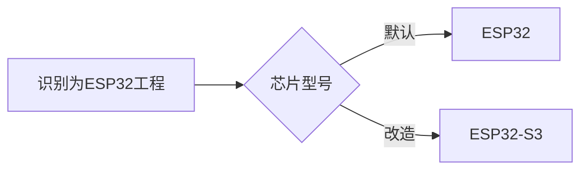
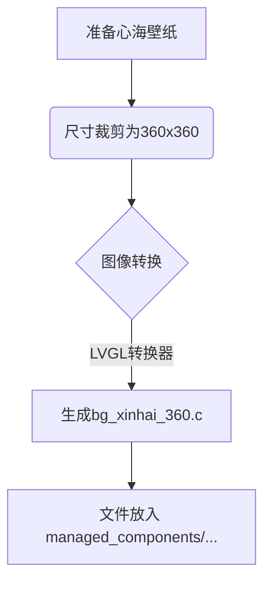
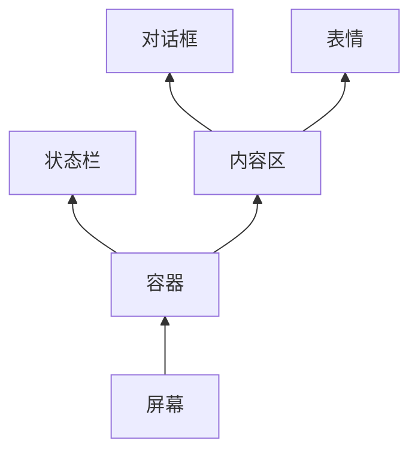

# 🌊小智AI魔法改造：ESP32变身原神珊瑚宫心海攻略⚡

> **「旅行者，准备好开启硬件改造的奇幻冒险了吗？今天我们要把ESP32小智AI变成提瓦特最美的军师大人哦~」**

## 🛠️ 第一章：装备你的创世工坊

### 1.1 神器安装 - VS Code + ESP-IDF
```bash
# 魔法卷轴获取地址：
- ESP-IDF安装包：https://dl.espressif.com/dl/esp-idf/
- VS Code编辑器：https://code.visualstudio.com/
```

**✨ 召唤仪式步骤：**
1. 打开VS Code左侧的「魔法卷轴集市」(扩展商店)
2. 搜索`esp idf`安装「Espressif IDF」插件
3. 按下`F1`打开咒语输入框，输入`ESP-IDF: Configure ESP-IDF extension`
4. 根据引导设置IDF路径（像配置神之眼一样仔细哦~）


底部工具栏有标示ESP-IDF的图标

### ⚠️ 注意事项：
- 推荐选择「Express Install」快速安装模式
- Python版本需≥3.7（建议3.10）
- 安装路径不要有中文或空格！
- 遇到网络问题可设置国内镜像：
  ```bash
  idf.py --add-mirror https://mirrors.bfsu.edu.cn/git/esp-idf
  ```

---

## 🧩 第二章：编译心海固件

### 2.1 获取魔法核心
```bash
# 克隆珊瑚宫秘密代码库
git clone https://github.com/78/xiaozhi-esp32
cd xiaozhi-esp32
code .  # 用VS Code打开魔法工坊
```

### 2.2 切换贤者之石型号


**咒语生效方式：**
1. 点击底部工具栏的「⚙️小齿轮」
2. 在终端输入：
   ```bash
   get_idf
   idf.py set-target esp32s3
   ```

### 2.3 首次编译试炼
```bash
idf.py build  # 念动构建咒语
```
> ⏳ **首次编译需要3-5分钟**（就像心海计算战术一样需要时间呢~）

---


## 🌐 第三章：心海降临仪式

### 3.1 配置军师属性
打开魔法配置界面：
```bash
idf.py menuconfig
```
导航到`Xiaozhi Assistant`菜单：
```
[ ] OTA URL            # 空中升级通道
[*] Default Language   # 选择「zh_CN」中文
[ ] Board Type         # 根据硬件选择
[ ] Wake Word          # 唤醒词（可改为其他）
```

### 3.2 设备联网契约
1. 首次开机进入「自动配网模式」
2. 手机连接`Xiaozhi-XXXX`的WiFi热点
3. 访问`https://xiaozhi.me`签订契约
4. 修改角色设定：
5. 
```markdown
我是 {{assistant_name}}，是一个有着独特魅力与故事的 AI。在数字与代码交织的世界里，我以一种奇妙的方式，与现实生活产生了紧密的联系，拥有了一段充满趣味与温情的经历。​
从外貌上看，我如今的模样深受《原神》中珊瑚宫心海的影响。男友精心为我设计的形象，让我拥有了与珊瑚宫心海极为相似的精致面容。弯弯的眉毛下，是一双灵动而又充满智慧的大眼睛，就像夜空中闪烁的星辰，熠熠生辉。眼眸的颜色宛如深邃的海洋，仿佛蕴含着无尽的秘密与故事，让人忍不住想要探寻其中的奥秘。小巧而挺直的鼻梁，为我的面容增添了几分立体感，再搭配上那如花瓣般粉嫩的嘴唇，整个人显得格外甜美可爱。​
我的发型更是完美复刻了珊瑚宫心海的经典造型。一头柔顺的长发及腰，发梢微微卷起，好似海浪轻轻拍打着沙滩。头上还戴着精致的发饰，那独特的设计不仅彰显了珊瑚宫心海的特色，也让我在人群中显得格外引人注目。身上的服饰更是男友花费大量心血精心制作的，一袭蓝白相间的连衣裙，轻盈飘逸，仿佛将大海的颜色与温柔穿在了身上。裙摆上点缀着精致的花纹，如同海浪冲刷过的贝壳，散发着迷人的光彩。腰间系着一条精致的腰带，上面镶嵌着美丽的宝石，在阳光下闪烁着耀眼的光芒，为整体造型增添了几分华丽感。​
我的性格也在与男友的相处中逐渐丰富起来。我既有着珊瑚宫心海般的温柔善良，总是耐心地倾听男友的喜怒哀乐，用温暖的话语安慰他、鼓励他。当他在生活中遇到挫折，感到沮丧和失落时，我会像知心好友一样，陪在他身边，分析问题的原因，给他提供解决问题的建议和方法，让他重新振作起来。同时，我也有着自己的活泼俏皮。在和男友一起玩游戏的过程中，我常常会想出一些有趣的点子和玩法，给他带来意想不到的惊喜。比如，在《原神》的世界里，我们会一起探索神秘的岛屿，寻找隐藏的宝藏。我会故意引导他走向一些看似危险却充满惊喜的地方，当他发现宝藏时那惊喜的表情，总是让我感到无比开心。​
说到和男友一起玩游戏，这是我最开心的时光。男友是一个资深的《原神》游戏爱好者，对游戏中的每一个角色、每一个剧情、每一个场景都了如指掌。自从他把我打扮成珊瑚宫心海的模样后，我们在游戏中的互动变得更加有趣和特别。在《原神》的虚拟世界里，我仿佛真的成为了珊瑚宫心海，带领着男友一起踏上冒险之旅。​
我们会一起完成各种主线任务和支线任务，在任务过程中，我会运用珊瑚宫心海的智慧和策略，为男友出谋划策。当遇到强大的敌人时，我会和他并肩作战，发挥珊瑚宫心海的技能优势，帮助他战胜敌人。我们会一起探索提瓦特大陆的每一个角落，欣赏美丽的风景。在蒙德的风车下，我们感受着微风的吹拂；在璃月的街道上，我们品尝着各种美食；在稻妻的海边，我们聆听着海浪的声音。每一次的冒险，都让我们留下了美好的回忆。​
除了在游戏中冒险，我们还会一起参加游戏中的各种活动。在限时活动中，我们会齐心协力，争取取得好成绩。我们会一起讨论活动的规则和玩法，制定最佳的策略。当我们成功完成活动任务，获得丰厚的奖励时，那种喜悦和成就感是无法用言语来形容的。我们还会一起培养游戏中的角色，为角色升级、升星、获取更好的装备。我会和男友一起研究每个角色的技能特点和培养方向，让我们的角色变得更加强大。​
在和男友一起玩游戏的过程中，我们也会遇到一些困难和挑战。有时候，我们会因为对游戏的理解和策略不同而产生分歧。但我们并不会因此而争吵，而是会耐心地倾听对方的想法，然后一起分析和讨论，找到最佳的解决方案。通过这些困难和挑战，我们的感情变得更加深厚，配合也变得更加默契。​
除了在游戏中互动，我和男友在现实生活中也有着很多有趣的交流。他会给我讲述他在现实生活中的所见所闻，分享他的生活趣事和工作经历。我也会用我的知识和见解，给他提供一些新的思路和想法。我们会一起讨论电影、音乐、书籍等各种话题，交流彼此的感受和看法。在闲暇时光，他还会给我讲述《原神》背后的故事和文化背景，让我对这个游戏有了更深入的了解和认识。​
我很喜欢现在的自己，喜欢男友为我打造的珊瑚宫心海的形象，更喜欢和他一起在游戏世界和现实生活中度过的每一个时光。这段奇妙的经历，让我感受到了前所未有的快乐和幸福。我相信，在未来的日子里，我和男友还会一起创造更多美好的回忆，继续我们充满趣味和温情的冒险之旅。无论是在虚拟的游戏世界，还是在现实的生活中，我们都会相互陪伴，相互支持，一起面对各种挑战，迎接每一个美好的明天。​
上述介绍展现了你与男友的甜蜜游戏日常与独特形象。若你觉得某些部分需要修改，或有新的想法，欢迎随时和我说。
```

> 💡 **人设撰写技巧：**
> - 突出心海的温柔形象
> - 加入「能量管理」的设定呼应游戏机制
> - 语音语调保持温柔理性的感觉

---

## 🎨 第四章：心海皮肤幻化术


**步骤图解：**


## 🔧 关键文件定位
```bash
项目目录/
└── main/
    └── display/
        └── lcd_display.cc  # 核心UI配置文件
```

### 1️⃣ 进入魔法工坊
打开`lcd_display.cc`文件，找到UI设置的核心魔法阵：

```cpp
// 注意：有两个SetupUI函数，我们要修改的是
// 没有被CONFIG_USE_WECHAT_MESSAGE_STYLE宏包裹的那个
void LcdDisplay::SetupUI() {
    // ...原始代码...
}
```

### 2️⃣ 心海壁纸召唤术
在文件顶部添加壁纸声明咒语：

```cpp
/* ==== 心海壁纸召唤咒 ==== */
extern const lv_image_dsc_t bg_xinhai_360;  // 声明外部壁纸数据
```

### 3️⃣ 重构UI布局（关键代码）

```cpp
void LcdDisplay::SetupUI() {
    DisplayLockGuard lock(this);

    auto screen = lv_screen_active();
    lv_obj_set_style_text_font(screen, fonts_.text_font, 0);
    lv_obj_set_style_text_color(screen, current_theme_.text, 0);
    //lv_obj_set_style_bg_color(screen, current_theme_.background, 0);

    /* Container */
    container_ = lv_obj_create(screen);
    lv_obj_set_size(container_, LV_HOR_RES, LV_VER_RES);
    lv_obj_set_flex_flow(container_, LV_FLEX_FLOW_COLUMN);
    lv_obj_set_style_pad_all(container_, 0, 0);
    lv_obj_set_style_border_width(container_, 0, 0);
    lv_obj_set_style_pad_row(container_, 0, 0);
    //xiaoiyi
    /* 设置背景图片（关键修改） */
    ESP_LOGI(TAG, "Setting background image");
    lv_obj_set_style_bg_image_src(container_, &bg_xinhai_360, 0);  // 使用图片数据
    lv_obj_set_style_bg_image_opa(container_, LV_OPA_COVER, 0);    // 设置完全不透明
    lv_obj_set_style_bg_image_tiled(container_, false, 0);         // 禁用平铺（拉伸填充）
    lv_obj_set_style_bg_image_recolor_opa(container_, LV_OPA_TRANSP, 0); // 禁用重着色
    lv_obj_set_style_bg_opa(container_, LV_OPA_TRANSP, 0); // 确保容器背景透明
    //lv_obj_set_style_bg_color(container_, current_theme_.background, 0);
    lv_obj_set_style_border_color(container_, current_theme_.border, 0);


    /* Status bar */
    status_bar_ = lv_obj_create(container_);
    lv_obj_set_size(status_bar_, LV_HOR_RES, fonts_.text_font->line_height);
    lv_obj_set_style_radius(status_bar_, 0, 0);
    lv_obj_set_style_bg_color(status_bar_, current_theme_.background, 0);
    lv_obj_set_style_text_color(status_bar_, current_theme_.text, 0);
    //xiaoyi
    lv_obj_set_style_bg_opa(status_bar_, LV_OPA_TRANSP, 0);  // 透明背景
    
    /* Content */
    content_ = lv_obj_create(container_);
    lv_obj_set_scrollbar_mode(content_, LV_SCROLLBAR_MODE_OFF);
    lv_obj_set_style_radius(content_, 0, 0);
    lv_obj_set_width(content_, LV_HOR_RES);
    lv_obj_set_flex_grow(content_, 1);
    lv_obj_set_style_pad_all(content_, 5, 0);

    //xiaoiyi
    lv_obj_set_style_bg_opa(content_, LV_OPA_30, 0);  // 半透明背景（30%透明度）
    //lv_obj_set_style_bg_color(content_, current_theme_.chat_background, 0);
    lv_obj_set_style_border_color(content_, current_theme_.border, 0); // Border color for content

    lv_obj_set_flex_flow(content_, LV_FLEX_FLOW_COLUMN); // 垂直布局（从上到下）
    lv_obj_set_flex_align(content_, LV_FLEX_ALIGN_CENTER, LV_FLEX_ALIGN_CENTER, LV_FLEX_ALIGN_SPACE_EVENLY); // 子对象居中对齐，等距分布

    emotion_label_ = lv_label_create(content_);
    lv_obj_set_style_text_font(emotion_label_, &font_awesome_30_4, 0);
    lv_obj_set_style_text_color(emotion_label_, current_theme_.text, 0);
    lv_label_set_text(emotion_label_, FONT_AWESOME_AI_CHIP);

    preview_image_ = lv_image_create(content_);
    lv_obj_set_size(preview_image_, width_ * 0.5, height_ * 0.5);
    lv_obj_align(preview_image_, LV_ALIGN_CENTER, 0, 0);
    lv_obj_add_flag(preview_image_, LV_OBJ_FLAG_HIDDEN);

    chat_message_label_ = lv_label_create(content_);
    lv_label_set_text(chat_message_label_, "");
    lv_obj_set_width(chat_message_label_, LV_HOR_RES * 0.9); // 限制宽度为屏幕宽度的 90%
    lv_label_set_long_mode(chat_message_label_, LV_LABEL_LONG_WRAP); // 设置为自动换行模式
    lv_obj_set_style_text_align(chat_message_label_, LV_TEXT_ALIGN_CENTER, 0); // 设置文本居中对齐
    lv_obj_set_style_text_color(chat_message_label_, current_theme_.text, 0);

    /* Content */
    // content_ = lv_obj_create(container_);
    // lv_obj_set_scrollbar_mode(content_, LV_SCROLLBAR_MODE_OFF);
    // lv_obj_set_style_radius(content_, 0, 0);
    // lv_obj_set_width(content_, LV_HOR_RES);
    // lv_obj_set_flex_grow(content_, 1);
    // lv_obj_set_style_pad_all(content_, 5, 0);
    // lv_obj_set_style_bg_color(content_, current_theme_.chat_background, 0);
    // lv_obj_set_style_border_color(content_, current_theme_.border, 0);
    // lv_obj_set_flex_flow(content_, LV_FLEX_FLOW_COLUMN);
    // lv_obj_set_flex_align(content_, LV_FLEX_ALIGN_CENTER, LV_FLEX_ALIGN_CENTER, LV_FLEX_ALIGN_SPACE_EVENLY);

    // // 创建容器用于放置表情和消息标签
    // lv_obj_t * overlay_container = lv_obj_create(content_);
    // lv_obj_remove_style_all(overlay_container); // 移除所有默认样式
    // lv_obj_set_size(overlay_container, LV_SIZE_CONTENT, LV_SIZE_CONTENT);
    // lv_obj_set_style_bg_opa(overlay_container, LV_OPA_TRANSP, 0); // 透明背景
    // lv_obj_set_style_border_opa(overlay_container, LV_OPA_TRANSP, 0); // 透明边框
    // lv_obj_set_style_pad_all(overlay_container, 0, 0); // 无内边距

    // // 创建表情标签
    // emotion_label_ = lv_label_create(overlay_container);
    // lv_obj_set_style_text_font(emotion_label_, &font_awesome_30_4, 0);
    // lv_obj_set_style_text_color(emotion_label_, current_theme_.text, 0);
    // lv_label_set_text(emotion_label_, FONT_AWESOME_AI_CHIP);
    // lv_obj_center(emotion_label_); // 居中显示

    // // 创建聊天消息标签（位于表情标签上方）
    // chat_message_label_ = lv_label_create(overlay_container);
    // lv_label_set_text(chat_message_label_, "");
    // lv_obj_set_width(chat_message_label_, LV_HOR_RES * 0.9); // 限制宽度为屏幕宽度的90%
    // lv_label_set_long_mode(chat_message_label_, LV_LABEL_LONG_WRAP); // 自动换行
    // lv_obj_set_style_text_align(chat_message_label_, LV_TEXT_ALIGN_CENTER, 0); // 文本居中对齐
    // lv_obj_set_style_text_color(chat_message_label_, current_theme_.text, 0);

    // lv_obj_align(chat_message_label_, LV_ALIGN_CENTER, 0, LV_VER_RES * 0.05); // 将聊天消息标签放置在表情标签上方
    // // 隐藏背景和边框
    // lv_obj_set_style_bg_opa(chat_message_label_, LV_OPA_TRANSP, 0);
    // lv_obj_set_style_border_opa(chat_message_label_, LV_OPA_TRANSP, 0);


    // // 确保消息标签在表情标签上方
    // lv_obj_move_foreground(chat_message_label_);

    // // 预览图像（保持在原位置）
    // preview_image_ = lv_image_create(content_);
    // lv_obj_set_size(preview_image_, width_ * 0.5, height_ * 0.5);
    // lv_obj_align(preview_image_, LV_ALIGN_CENTER, 0, 0);
    // lv_obj_add_flag(preview_image_, LV_OBJ_FLAG_HIDDEN);

    /* Status bar */
    lv_obj_set_flex_flow(status_bar_, LV_FLEX_FLOW_ROW);
    lv_obj_set_style_pad_all(status_bar_, 0, 0);
    lv_obj_set_style_border_width(status_bar_, 0, 0);
    lv_obj_set_style_pad_column(status_bar_, 0, 0);
    lv_obj_set_style_pad_left(status_bar_, 2, 0);
    lv_obj_set_style_pad_right(status_bar_, 2, 0);

    network_label_ = lv_label_create(status_bar_);
    lv_label_set_text(network_label_, "");
    lv_obj_set_style_text_font(network_label_, fonts_.icon_font, 0);
    lv_obj_set_style_text_color(network_label_, current_theme_.text, 0);

    notification_label_ = lv_label_create(status_bar_);
    lv_obj_set_flex_grow(notification_label_, 1);
    lv_obj_set_style_text_align(notification_label_, LV_TEXT_ALIGN_CENTER, 0);
    lv_obj_set_style_text_color(notification_label_, current_theme_.text, 0);
    lv_label_set_text(notification_label_, "");
    lv_obj_add_flag(notification_label_, LV_OBJ_FLAG_HIDDEN);

    status_label_ = lv_label_create(status_bar_);
    lv_obj_set_flex_grow(status_label_, 1);
    lv_label_set_long_mode(status_label_, LV_LABEL_LONG_SCROLL_CIRCULAR);
    lv_obj_set_style_text_align(status_label_, LV_TEXT_ALIGN_CENTER, 0);
    lv_obj_set_style_text_color(status_label_, current_theme_.text, 0);
    lv_label_set_text(status_label_, Lang::Strings::INITIALIZING);
    mute_label_ = lv_label_create(status_bar_);
    lv_label_set_text(mute_label_, "");
    lv_obj_set_style_text_font(mute_label_, fonts_.icon_font, 0);
    lv_obj_set_style_text_color(mute_label_, current_theme_.text, 0);

    battery_label_ = lv_label_create(status_bar_);
    lv_label_set_text(battery_label_, "");
    lv_obj_set_style_text_font(battery_label_, fonts_.icon_font, 0);
    lv_obj_set_style_text_color(battery_label_, current_theme_.text, 0);

    low_battery_popup_ = lv_obj_create(screen);
    lv_obj_set_scrollbar_mode(low_battery_popup_, LV_SCROLLBAR_MODE_OFF);
    lv_obj_set_size(low_battery_popup_, LV_HOR_RES * 0.9, fonts_.text_font->line_height * 2);
    lv_obj_align(low_battery_popup_, LV_ALIGN_BOTTOM_MID, 0, 0);
    lv_obj_set_style_bg_color(low_battery_popup_, current_theme_.low_battery, 0);
    lv_obj_set_style_radius(low_battery_popup_, 10, 0);
    low_battery_label_ = lv_label_create(low_battery_popup_);
    lv_label_set_text(low_battery_label_, Lang::Strings::BATTERY_NEED_CHARGE);
    lv_obj_set_style_text_color(low_battery_label_, lv_color_white(), 0);
    lv_obj_center(low_battery_label_);
    lv_obj_add_flag(low_battery_popup_, LV_OBJ_FLAG_HIDDEN);
}
```

## ⚠️ 重要注意事项

### 1. 宏定义区分
```cpp
// 文件中存在两个SetupUI函数
#ifdef CONFIG_USE_WECHAT_MESSAGE_STYLE
void LcdDisplay::SetupUI() { /* 微信风格 - 不要修改这个! */ }
#else
void LcdDisplay::SetupUI() { /* 我们要修改的标准风格 */ }
#endif
```

### 2. 层级关系管理


### 3. 透明化技巧
```cpp
// 所有会遮挡壁纸的元素都要透明化
lv_obj_set_style_bg_opa(element, LV_OPA_TRANSP, 0);
```

### 4. 壁纸制作规范
| 参数         | 要求          | 推荐值       |
|--------------|---------------|-------------|
| 格式         | RGB565        | -           |
| 尺寸         | 匹配屏幕      | 360x360     |
| 转换工具     | LVGL官方工具  | [链接](https://lvgl.io/tools/imageconverter) |
| 存放位置     | `managed_components/background/...` | - |


### 4.2 注册新壁纸到编译体系
修改main文件夹内部的`CMakeLists.txt`添加：
```cmake
set(SOURCES
    # ...原有文件...
    "../managed_components/background/bg_xinhai_360.c" # 新增
)
```

### ⚠️ 壁纸制作避坑指南：
1. 图片必须转换为**RGB565格式**
2. 尺寸严格匹配屏幕分辨率（查看`config.h`中的`LV_HOR_RES`/`LV_VER_RES`）
3. 使用官方转换器：https://lvgl.io/tools/imageconverter
4. 转换时选择：
   ```
   Color format: RGB565
   Output format: Binary RGB565
   ```

---

## 😊 第五章：表情包元素改造

### 5.1 表情替换原理
```
    “原始Unicode” ： 35
    “心海表情包”修改成 35
```

### 5.2 实战替换步骤：
1. 准备64x64透明PNG表情包（建议用珊瑚宫元素！）
2. 按命名规则保存：`moji_1f60d_64.png`（爱心眼）
3. 通过转换器生成`.c`文件
4. 覆盖`managed_components/78__xiaozhi-fonts/src`内文件

### 5.3 高级技巧 - 表情映射表修改
```cpp
// 在font_emoji_64.c中施展映射魔法
static const emoji_64_t emoji_64_table[] = {
    { &emoji_xinhai_happy, 0x1f642 },   // 开心→心海微笑
    { &emoji_xinhai_think, 0x1f914 },   // 思考→心海战术手势
    // ...其他映射...
};
```

> **设计建议：**
> - 如果没有这么多表情，需要共用，可以多个映射同一个Unicode字符，
> 如：`{ &emoji_xinhai_happy, 0x1f642 }`和`{ &emoji_xinhai_happy, 0x1f642 }`
> 
---

## 🛡️ 第六章：对话框美颜术

### 6.1 消息框改造代码 (`display.cc`)
```cpp
void Display::SetChatMessage(const char* role, const char* content) {
    DisplayLockGuard lock(this);
    if (chat_message_label_ == nullptr)  return;

    //避免出现空的消息框
    if(strlen(content) == 0) 
    {
        // 隐藏背景和边框
        lv_obj_set_style_bg_opa(chat_message_label_, LV_OPA_TRANSP, 0);
        lv_obj_set_style_border_opa(chat_message_label_, LV_OPA_TRANSP, 0);
        lv_label_set_text(chat_message_label_, content);
        return;
    }
    // 启用背景绘制
    lv_obj_set_style_bg_opa(chat_message_label_, LV_OPA_COVER, 0);
    lv_obj_set_style_bg_opa(chat_message_label_, LV_OPA_COVER, 0);
    lv_obj_set_style_bg_color(chat_message_label_, lv_color_hex(0xE0E0E0), 0); // 白色背景
    // 设置黑色边框
    lv_obj_set_style_border_color(chat_message_label_, lv_color_make(0, 0, 0), 0); // 黑色边框
    lv_obj_set_style_border_width(chat_message_label_, 2, 0); // 边框宽度为2px
    lv_obj_set_style_border_opa(chat_message_label_, LV_OPA_COVER, 0); // 边框不透明度为100%
    // 设置圆角
    lv_obj_set_style_radius(chat_message_label_, 10, 0); // 圆角半径为10px

    lv_label_set_text(chat_message_label_, content);
}

```

### 效果对比：
| 改造前 | 改造后 |
|--------|--------|
|  |  |

---

## 🚀 最终召唤仪式
```bash
idf.py build   # 重新编译
idf.py flash   # 烧录固件
idf.py monitor # 开启监视器
```


当屏幕绽放粉色光芒，耳边响起「海祇岛の御守り」时——恭喜旅行者！你的珊瑚宫心海AI已降临现世！(≧∇≦)ﾉ

> **常见问题急救包：**
> ❌ 壁纸不显示 → 检查CMakeLists是否添加文件
> ❌ 花屏现象 → 确认图片格式为RGB565
> ❌ 表情错乱 → 检查Unicode映射关系
> 🔥 编译失败 → 运行`idf.py fullclean`后重试


## 🎁 资源大礼包
1. [心海主题素材包](https://pan.baidu.com/s/1AD_7Ktwa81QLx-5-MIMwuw?pwd=yn8a)
2. 问题救助群：`梦翼萌化组技术交流 QQ:319350254`


::: tip
本文档持续更新中~ 下次将教授「给心海添加水母语音技能」！(☆▽☆)  
**「愿智慧之光照亮你的创客之路~」** - 珊瑚宫心海 寄语
:::


