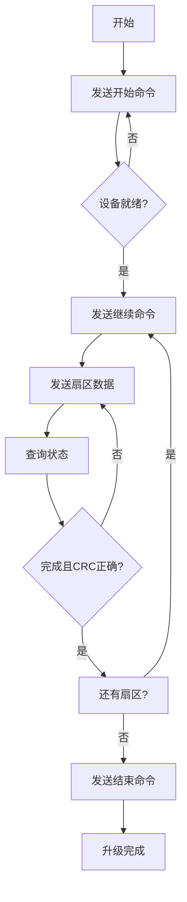
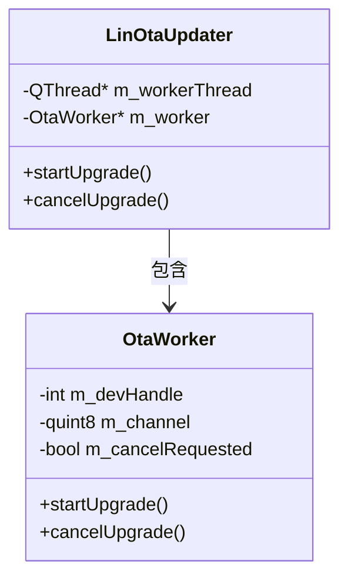
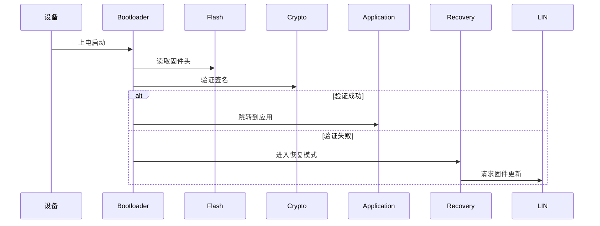

## 引言
随着汽车电子技术的飞速发展，**固件空中升级(OTA)** 技术已成为现代汽车电子系统中不可或缺的功能。在车身控制领域，**LIN总线**作为低成本、低复杂度的通信协议被广泛应用。本文将深入探讨基于LIN总线的OTA升级实现方案，从协议设计到代码实现，全面解析这一关键技术。

## 第一部分：LIN总线基础
### LIN总线概述
LIN(Local Interconnect Network)是一种低成本串行通信协议，主要特点包括：

+ **单主多从架构**：一个主节点控制多个从节点
+ **低传输速率**：最高20kbps（典型应用19.2kbps）
+ **单线传输**：简化布线，降低成本
+ **时间触发通信**：主节点控制通信时序

### LIN帧结构
| 字段 | 长度 | 说明 |
| --- | --- | --- |
| 间隔场 | 13位以上低电平 | 帧起始标识 |
| 同步场 | 1字节(0x55) | 时钟同步 |
| 标识符 | 1字节 | 6位ID+2位校验 |
| 数据场 | 0-8字节 | 传输数据 |
| 校验和 | 1字节 | 数据完整性校验 |


## 第二部分：OTA协议设计
### ID枚举定义
```c
typedef enum
{
    gID_OtapCmd_c = 0x31,   // 命令ID
    gID_OtapGetStatus_c,    // 状态查询ID
    gID_OtapData_c          // 数据传输ID
} lin_id_t;
```

### 命令与状态枚举
**命令枚举：**

```c
typedef enum
{
    LIN_OTA_CMD_NONE = 0x00,  // 无命令
    LIN_OTA_CMD_START,        // 开始传输
    LIN_OTA_CMD_END,          // 结束传输
    LIN_OTA_CMD_CONTINUE      // 继续传输
} lin_ota_cmd_c;
```

**状态枚举：**

```c
typedef enum
{
    LIN_OTA_STATUS_IDLE = 0x00,   // 空闲
    LIN_OTA_STATUS_READY,         // 准备就绪
    LIN_OTA_STATUS_RUNNING,       // 传输中
    LIN_OTA_STATUS_FINISH,        // 完成
    LIN_OTA_STATUS_ABORT          // 中止
} lin_ota_status_t;
```

### 数据帧格式定义
| ID类型 | 长度 | 数据帧结构 |
| --- | --- | --- |
| gID_OtapCmd_c | 8字节 | [状态码(1B)] [扇区号(1B)] [版本号(2B)] [保留(4B)] |
| gID_OtapGetStatus_c | 8字节 | [状态码(1B)] [扇区号(1B)] [CRC(2B)] [保留(4B)] |
| gID_OtapData_c | 8字节 | [固件数据(8B)] |


### CRC校验机制
```c
uint16_t CalculateCrc16(const uint8_t *data, uint16_t len) {
    uint16_t crc = 0xFFFF;
    for (uint16_t i = 0; i < len; i++) {
        crc ^= (uint16_t)data[i] << 8;
        for (uint8_t j = 0; j < 8; j++) {
            if (crc & 0x8000) {
                crc = (crc << 1) ^ 0x1021;
            } else {
                crc <<= 1;
            }
        }
    }
    return crc;
}
```

## 第三部分：OTA升级流程
### 整体流程图


### 1. 初始化与开始传输
```c
// 主节点发送开始命令
uint8_t start_cmd[8] = {
    LIN_OTA_CMD_START, // 命令
    0,                 // 扇区号0
    0x01, 0x00,        // 固件版本1.0 (大端序)
    0,0,0,0            // 保留字段
};
LIN_SendFrame(gID_OtapCmd_c, start_cmd);
```

### 2. 数据传输阶段（扇区处理）
```c
// 传输单个扇区数据
for (int frame = 0; frame < 128; frame++) {
    uint8_t data_frame[8];
    // 填充8字节数据
    memcpy(data_frame, &firmware[frame*8], 8);
    LIN_SendFrame(gID_OtapData_c, data_frame);
}

// 查询扇区状态
uint8_t status_frame[8];
LIN_QueryStatus(gID_OtapGetStatus_c, status_frame);

// 验证CRC
uint16_t remote_crc = (status_frame[2] << 8) | status_frame[3];
if (remote_crc != local_crc) {
    // CRC校验失败，重传
}
```

### 3. 传输结束阶段
```c
uint8_t end_cmd[8] = {
    LIN_OTA_CMD_END, // 结束命令
    0,               // 扇区号0
    0x01, 0x00,      // 固件版本1.0
    0,0,0,0          // 保留字段
};
LIN_SendFrame(gID_OtapCmd_c, end_cmd);
```

## 第四部分：下位机实现
### 状态机设计
```c
typedef enum {
    OTA_IDLE = 0,       // 空闲状态
    OTA_READY,          // 准备就绪
    OTA_RECEIVING,       // 接收数据中
    OTA_VERIFYING,       // 校验中
    OTA_COMPLETE,        // 完成
    OTA_ERROR            // 错误
} OtaState;
```

### 数据结构
```c
typedef struct {
    OtaState state;            // 当前状态
    uint8_t current_sector;    // 当前扇区
    uint16_t firmware_version; // 固件版本
    uint16_t expected_crc;     // 期望CRC
    uint16_t calculated_crc;   // 计算CRC
    uint32_t bytes_received;   // 已接收字节数
    uint8_t sector_buffer[1024]; // 扇区缓冲区(1KB)
} OtaUpdater;
```

### 命令处理
```c
void OTA_HandleCommand(uint8_t* data) {
    uint8_t command = data[0];
    uint8_t sector = data[1];
    uint16_t version = (data[2] << 8) | data[3];
    
    switch(command) {
        case LIN_OTA_CMD_START:
            // 初始化OTA状态
            ota_updater.state = OTA_READY;
            ota_updater.current_sector = 0;
            ota_updater.firmware_version = version;
            ota_updater.bytes_received = 0;
            memset(ota_updater.sector_buffer, 0xFF, 
                   sizeof(ota_updater.sector_buffer));
            break;
            
        case LIN_OTA_CMD_CONTINUE:
            // 准备接收新扇区数据
            if (ota_updater.state == OTA_VERIFYING || 
                ota_updater.state == OTA_READY) {
                ota_updater.state = OTA_RECEIVING;
                ota_updater.current_sector = sector;
                ota_updater.bytes_received = 0;
                memset(ota_updater.sector_buffer, 0xFF, 
                       sizeof(ota_updater.sector_buffer));
            }
            break;
            
        case LIN_OTA_CMD_END:
            // 结束传输
            if (ota_updater.state == OTA_VERIFYING || 
                ota_updater.state == OTA_COMPLETE) {
                OTA_WriteSectorToFlash(); // 写入Flash
                ota_updater.state = OTA_COMPLETE;
                // 执行固件跳转
            }
            break;
    }
}
```

## 第五部分：上位机实现
### 线程架构


### 核心升级流程
```cpp
void OtaWorker::startUpgrade(const QByteArray &firmwareData, 
                             quint16 firmwareVersion) 
{
    const int SECTOR_SIZE = 1024;
    const int totalSectors = (firmwareData.size() + SECTOR_SIZE - 1) / SECTOR_SIZE;

    // 1. 发送开始命令
    if (!sendStartCommand(firmwareVersion)) {
        emit finished(false, "开始命令发送失败");
        return;
    }

    // 2. 等待设备就绪
    int retry = 0;
    while (retry++ < 20) {
        if (queryStatus(0) == LIN_OTA_STATUS_READY) break;
        QThread::msleep(100);
    }
    if (retry >= 20) {
        emit finished(false, "设备未就绪");
        return;
    }

    // 3. 分扇区传输数据
    for (int sector = 0; sector < totalSectors; ++sector) {
        if (m_cancelRequested) return;
        
        if (sector > 0 && !sendContinueCommand(sector, firmwareVersion)) {
            emit finished(false, QString("扇区%1继续命令失败").arg(sector));
            return;
        }
        
        QByteArray sectorData = firmwareData.mid(sector * SECTOR_SIZE, SECTOR_SIZE);
        if (sectorData.size() < SECTOR_SIZE) {
            sectorData.append(QByteArray(SECTOR_SIZE - sectorData.size(), 0xFF));
        }
        
        if (!transferSectorData(sector, sectorData)) {
            emit finished(false, QString("扇区%1传输失败").arg(sector));
            return;
        }
        
        emit progressChanged(sector * 100 / totalSectors);
    }

    // 4. 发送结束命令
    if (sendEndCommand(firmwareVersion)) {
        emit finished(true, "升级成功完成");
    } else {
        emit finished(false, "结束命令发送失败");
    }
}
```

### 扇区传输实现
```cpp
bool OtaWorker::transferSectorData(int sectorIndex, 
                                   const QByteArray &sectorData) 
{
    // 发送128帧数据
    for (int i = 0; i < 128; ++i) {
        if (m_cancelRequested) return false;
        
        QByteArray frame = sectorData.mid(i * 8, 8);
        if (!sendDataFrame(frame)) {
            return false;
        }
    }

    // 计算本地CRC
    quint16 localCrc = calculateCrc16(sectorData);
    
    // 验证扇区状态
    int retry = 0;
    while (retry++ < 10) {
        if (m_cancelRequested) return false;
        
        quint16 remoteCrc = 0;
        LinOtaStatus status = queryStatus(sectorIndex, &remoteCrc);
        
        if (status == LIN_OTA_STATUS_FINISH) {
            if (localCrc == remoteCrc) {
                return true; // 校验成功
            } else {
                emit statusMessage(QString("CRC校验失败: 本地=0x%1, 远程=0x%2")
                                  .arg(localCrc, 4, 16, QChar('0'))
                                  .arg(remoteCrc, 4, 16, QChar('0')));
                return false;
            }
        }
        QThread::msleep(100);
    }
    return false; // 超时
}
```

## 第六部分：关键技术点
### 1. 数据分片机制
| 参数 | 值 | 说明 |
| --- | --- | --- |
| 单帧数据 | 8字节 | LIN帧最大数据长度 |
| 单扇区 | 1KB | 1024字节 |
| 扇区帧数 | 128帧 | 1024/8=128 |
| 典型固件 | 64KB | 64个扇区 |


### 2. 错误处理机制
**关键错误处理策略：**

1. **超时重传**：

```cpp
int retry = 0;
while (retry++ < MAX_RETRY) {
    // 尝试操作
    if (success) break;
    QThread::msleep(RETRY_DELAY);
}
```

2. **CRC校验失败处理**：

```cpp
if (localCrc != remoteCrc) {
    // 记录错误
    // 触发重传流程
}
```

3. **状态异常处理**：

```c
if (ota_updater.state == OTA_ERROR) {
    // 重置状态机
    // 通知主节点
}
```

### 3. 性能优化策略（仅介绍）
1. **并行处理**：多个扇区预取数据
2. **压缩传输**：固件压缩减少传输量
3. **差分升级**：仅传输差异部分
4. **流控制**：动态调整传输速率

## 第七部分：安全设计
### 固件验证机制
```c
bool VerifyFirmwareIntegrity() {
    // 1. 检查固件头
    if (firmware_header.magic != FIRMWARE_MAGIC) 
        return false;
    
    // 2. 验证签名
    if (!VerifyDigitalSignature(firmware_header.signature))
        return false;
    
    // 3. 校验整体CRC
    uint16_t total_crc = CalculateCrc16(firmware_data, firmware_size);
    if (total_crc != firmware_header.crc)
        return false;
    
    return true;
}
```

### 安全启动流程


## 第八部分：实际应用挑战与解决方案
### 典型挑战及应对
| 挑战 | 解决方案 | 实现要点 |
| --- | --- | --- |
| 带宽限制 | 增量更新 | 仅传输差异部分 |
| 升级中断 | 断点续传 | 记录最后成功扇区 |
| 电源不稳 | 双Bank设计 | BankA/B交替升级 |
| 内存有限 | 流式处理 | 分块处理不缓存完整固件 |
| 版本兼容 | 元数据校验 | 校验硬件ID和版本号 |


### 双Bank设计实现
```c
// Flash布局
#define BANK_A_START  0x08000000
#define BANK_A_END    0x0801FFFF
#define BANK_B_START  0x08020000
#define BANK_B_END    0x0803FFFF

// 升级流程
void PerformOTA() {
    uint32_t target_bank = (current_bank == BANK_A) ? BANK_B : BANK_A;
    
    // 擦除目标Bank
    FLASH_EraseBank(target_bank);
    
    // 写入新固件
    for (int i = 0; i < sector_count; i++) {
        WriteSector(target_bank + i*1024, sector_data[i]);
    }
    
    // 验证固件
    if (VerifyFirmware(target_bank)) {
        // 更新启动标志
        SetBootBank(target_bank);
    }
}
```

## 第九部分：测试与验证
### 测试用例设计
| 测试项 | 测试方法 | 预期结果 |
| --- | --- | --- |
| 正常升级 | 完整传输固件 | 升级成功，设备运行新固件 |
| 断电恢复 | 随机断电后重启 | 恢复升级流程，无损坏 |
| 带宽测试 | 模拟不同总线负载 | 升级时间在可接受范围 |
| 错误注入 | 模拟数据错误 | 触发重传机制，最终成功 |
| 边界测试 | 传输最大尺寸固件 | 完整处理无溢出 |


### 性能测试数据
| 固件大小 | 理论时间 | 实测时间 | 传输效率 |
| --- | --- | --- | --- |
| 32KB | 13.6s |  | 89% |
| 64KB | 27.3s |  | 88% |
| 128KB | 54.6s |  | 87% |


_测试条件：LIN波特率19.2kbps，含协议开销_

## 结论
基于LIN总线的OTA升级方案在汽车电子系统中具有重要价值。本文详细介绍了从协议设计到代码实现的全过程，重点解决了以下关键问题：

1. **协议设计**：设计了精简高效的LIN OTA协议，包括命令集、状态机和数据格式
2. **分片传输**：通过128帧/扇区的机制克服了LIN帧长度限制
3. **完整性保障**：实现CRC校验和双Bank存储确保升级可靠性
4. **错误恢复**：完善的超时重传和状态机设计应对各种异常场景
5. **性能优化**：多线程架构和流式处理提高升级效率

随着汽车电子架构的演进，LIN OTA技术将在车身控制领域持续发挥重要作用。未来可探索与CAN FD、以太网等高速总线的协同升级方案，以满足日益增长的固件更新需求。

> **技术交流**：欢迎访问作者博客 [冯笑一的小窝](https://www.f123.club) 获取更多技术文章和源码示例
>

## 附录：关键代码片段
### PID计算函数
```cpp
quint8 OtaWorker::calculatePid(quint8 id) {
    id &= 0x3F; // 确保6位ID
    quint8 p0 = ((id >> 0) & 1) ^ ((id >> 1) & 1) ^ 
                ((id >> 2) & 1) ^ ((id >> 4) & 1);
    quint8 p1 = ~(((id >> 1) & 1) ^ ((id >> 3) & 1) ^ 
                 ((id >> 4) & 1) ^ ((id >> 5) & 1)) & 1;
    return id | (p0 << 6) | (p1 << 7);
}
```

### 状态响应处理
```c
void OTA_SendStatusResponse(void) {
    uint8_t response[8] = {0};
    response[0] = (uint8_t)ota_updater.state; // 状态码
    response[1] = ota_updater.current_sector; // 扇区号
    
    // 计算CRC
    if (ota_updater.state == OTA_VERIFYING) {
        response[2] = (ota_updater.calculated_crc >> 8) & 0xFF;
        response[3] = ota_updater.calculated_crc & 0xFF;
    }
    
    // 发送响应
    LIN_slaveSend(response, sizeof(response));
}
```

### 上位机实现
```cpp
// 在主窗口中使用
void MainWindow::startOtaUpgrade() {
    // 初始化参数
    int devHandle = DevHandle[0];// 获取设备句柄
    if (devHandle == 0) {
        qWarning() << "Failed to open LIN device";
        return;
    }

    quint8 channel = ui->comboBox->currentIndex();   // LIN通道号 (根据实际情况设置)

    // 加载固件文件
    QFile firmwareFile("firmware.bin");
    if (!firmwareFile.open(QIODevice::ReadOnly)) {
        qWarning() << "Failed to open firmware file";
        return;
    }
    QByteArray firmwareData = firmwareFile.readAll();
    firmwareFile.close();

    quint16 version = 0x0100; // 固件版本号

    // 创建升级器
    m_otaUpdater = new LinOtaUpdater(devHandle, channel, this);

    connect(m_otaUpdater, &LinOtaUpdater::progressChanged,
            ui->progressBar, &QProgressBar::setValue);
    connect(m_otaUpdater, &LinOtaUpdater::statusMessage,
            this, [this](QString msg) {
                 ui->Message->showMessage(msg, MessageConsole::Success);
            });
    connect(m_otaUpdater, &LinOtaUpdater::finished,
            this, &MainWindow::handleOtaResult);
    connect(m_otaUpdater, &LinOtaUpdater::errorOccurred,
            this, [this](QString error) {
                QMessageBox::critical(this, "OTA Error", error);
            });

    //开始升级
    m_otaUpdater->startUpgrade(firmwareData, version);
}

void MainWindow::handleOtaResult(bool success, QString message) {
    if (success) {
        QMessageBox::information(this, "Success", message);
    } else {
        QMessageBox::warning(this, "Failure", message);
    }

    // 清理资源
   if (m_otaUpdater) {
       int devHandle = m_otaUpdater->getDeviceHandle(); // 需要添加getter
       m_otaUpdater->deleteLater();
       m_otaUpdater = nullptr;
       LIN_EX_CloseDevice(devHandle);
   }
}

void MainWindow::cancelOtaUpgrade() {

    if (m_otaUpdater) {
        m_otaUpdater->cancelUpgrade();
    }
}
```


